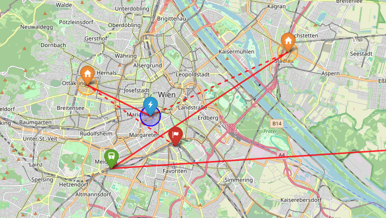

# Find My Forensics: Pattern-of-Life Analysis from Apple Find My Pings

## 🚀 Overview

This repository documents a real-world case study in which Apple Find My network data was used to reconstruct the 
movement and behavioral patterns of a stolen device. By systematically observing location ping 
frequency, command response behavior, and status transitions within the Find My app, it was possible to build a 
pattern-of-life (PoL) analysis that identified likely residential locations, inferred moments of human interaction with the 
device, and traced movement between locations of interest. The repository provides a documented analytical framework and 
Python-based geospatial visualizations with privacy-preserving anonymization. 
All location data has been anonymized in accordance with GDPR Article 5 to prevent identification of any individual.

## 🗺️ Static PoL Maps

Vienna (June 28 - July 2):



## 🔍 Display Interactive PoL Maps

Serve from a small, local web server:

```
python -m http.server
```

Open in your web browser:

```
http://localhost:8000/AirPods_PoL_EU.html
```

## ▶️ How to Run

### venv and pip

Create environment:

```
python3.12 -m venv .venv
```

If using Mac/Linux:

```
source .venv/bin/activate
```

If using Windows:

```
.venv\Scripts\activate
```

Install requirements:

```
pip install -r requirements.txt
```

## 🛠️ Tech Stack
- Python (3.12)
- Folium (geospatial visualization)
- Jupyter Notebook

## ⚠️ Legal Disclaimer

This repository documents a personal case study and analytical methodology for recovering a stolen device using Apple's Find My network. It is intended solely for educational purposes and to assist individuals in recovering their own lost or stolen Apple devices in cooperation with law enforcement.

**Intended Use**

The methods, code, and analysis presented in this repository are designed exclusively for:
- Tracking devices you own or are legally authorized to monitor
- Assisting law enforcement with evidence gathering in the context of device theft
- Academic and educational understanding of Apple's Find My network behavior

**GDPR & Privacy Law**

This project was developed in Austria and is subject to the General Data Protection Regulation (EU) 2016/679 (GDPR). Users of this methodology outside Austria remain subject to the GDPR if they are located in the European Economic Area, or to equivalent privacy legislation in their jurisdiction.
Under GDPR Article 6, any processing of personal location data requires a lawful basis. Tracking the location of another individual without their consent, a legitimate legal interest, or law enforcement authorization is unlawful and may constitute a criminal offense under applicable national law.
The location data presented in this repository has been anonymized and generalized to prevent identification of any individual. Specific addresses, movement patterns, and behavioral inferences have been obscured or aggregated in accordance with GDPR principles of data minimization (Article 5(1)(c)) and purpose limitation (Article 5(1)(b)).
No Warranty & Limitation of Liability
This project is provided "as is", without warranty of any kind, express or implied. The author:

Makes no representations about the accuracy, completeness, or fitness for purpose of any information or code contained herein
Accepts no liability for any direct, indirect, incidental, or consequential damages arising from use of this methodology
Is not responsible for any unlawful use of this methodology by third parties
Does not endorse vigilante action, physical confrontation, or any action taken outside of official law enforcement channels

**Important Safety Notice**

If your device has been stolen, do not attempt to recover it yourself. Share your location data with local law enforcement and allow them to act on it. Attending a suspected thief's location based on Find My data is dangerous and may be unlawful depending on your jurisdiction.

**Contact & Takedown**

If any content in this repository inadvertently contains information that could identify a real individual, or if you believe content violates applicable privacy law, please open an issue or contact the repository owner directly for prompt removal.
